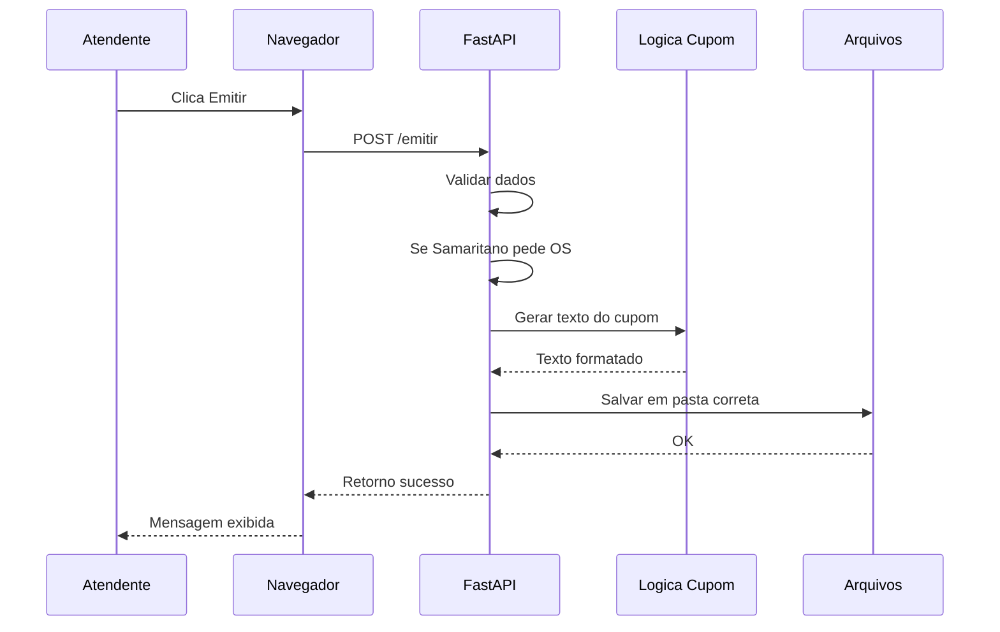

```mermaid
sequenceDiagram
    participant U as Atendente
    participant UI as Navegador
    participant API as FastAPI
    participant CORE as Logica Cupom
    participant FS as Arquivos

    U ->> UI: Clica Emitir
    UI ->> API: POST /emitir

    API ->> API: Validar dados
    API ->> API: Se Samaritano pede OS

    API ->> CORE: Gerar texto do cupom
    CORE -->> API: Texto formatado

    API ->> FS: Salvar em pasta correta
    FS -->> API: OK

    API -->> UI: Retorno sucesso
    UI -->> U: Mensagem exibida


```