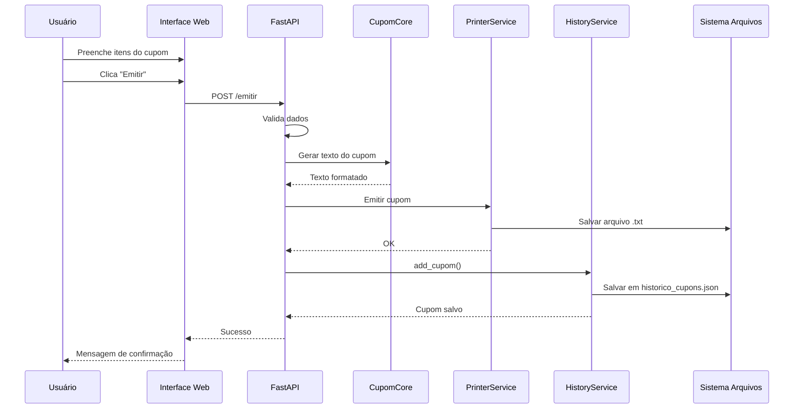
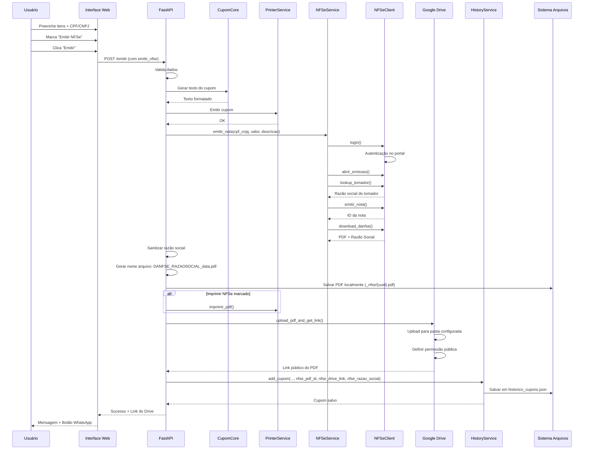
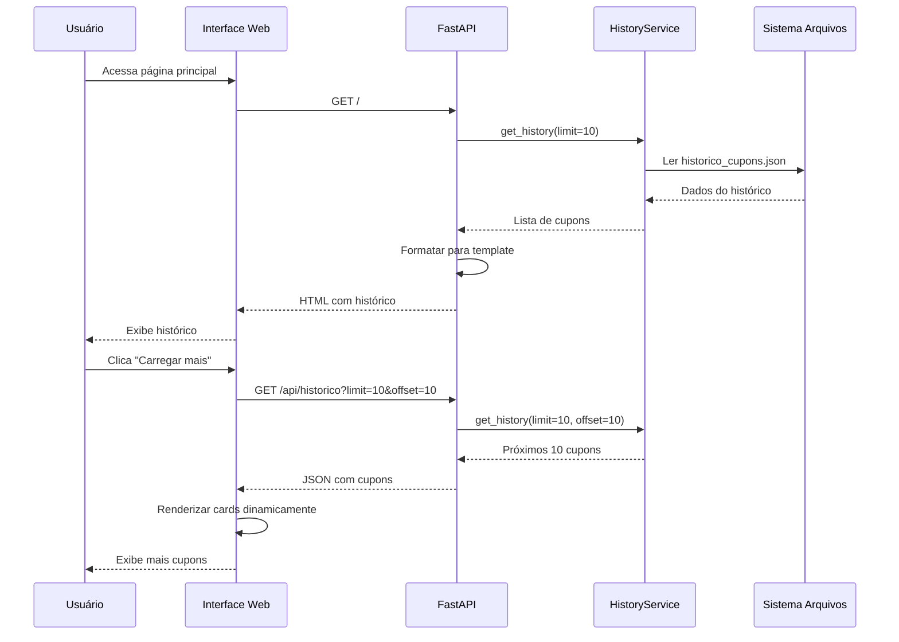

# Arquitetura do Sistema - Chaveiro Brotero

## Visão Geral

Sistema web para emissão de cupons fiscais com integração a impressora ESC/POS, emissão de Nota Fiscal de Serviços Eletrônica (NFSe) e armazenamento em Google Drive.

## Componentes Principais

### 1. **Frontend (Templates HTML + CSS + JavaScript)**
- **Localização**: `app/templates/index.html`, `app/static/style.css`
- **Tecnologias**: Jinja2 Templates, JavaScript Vanilla
- **Funcionalidades**:
  - Interface para cadastro de itens do cupom
  - Pré-visualização do cupom
  - Histórico de cupons emitidos
  - Integração com WhatsApp para envio de NFSe
  - Modo escuro/claro
  - Carregamento dinâmico de histórico

### 2. **Backend API (FastAPI)**
- **Localização**: `app/main.py`
- **Tecnologias**: FastAPI, Python 3.10+
- **Endpoints Principais**:
  - `GET /` - Página principal
  - `POST /preview` - Pré-visualização do cupom
  - `POST /emitir` - Emissão do cupom
  - `GET /api/historico` - API de histórico
  - `POST /api/cupom/{id}/cancelar` - Cancelamento de cupom
  - `GET /api/nfse/download/{pdf_id}` - Download de DANFSE
  - `GET /relatorios` - Página de relatórios
  - `GET /api/relatorio/*` - APIs de relatórios

### 3. **Lógica de Negócio**

#### 3.1. **Cupom Core** (`app/cupom_core.py`)
- Formatação de texto do cupom
- Suporte a cupons padrão e Samaritano
- Cálculo de totais

#### 3.2. **Histórico** (`app/history.py`)
- **HistoryService**: Gerencia histórico de cupons
- Armazenamento em JSON (`historico_cupons.json`)
- Funcionalidades:
  - Adicionar cupom ao histórico
  - Buscar histórico com paginação
  - Cancelar cupom
  - Relatórios por período
  - Fechamento de caixa
  - Fechamento de caixa Samaritano
- **Campos do Cupom**:
  - ID único
  - Data de emissão
  - Tipo (Padrão/Samaritano)
  - Número da OS (se Samaritano)
  - Itens (descrição, quantidade, valor)
  - Total
  - Status (ATIVO/CANCELADO)
  - NFSe: PDF ID, link do Drive, razão social do tomador

### 4. **Integração com Impressora** (`app/printer.py`)
- **PrinterService**: Comunicação com impressora ESC/POS
- Funcionalidades:
  - Emissão de cupom em texto
  - Impressão de PDF (para NFSe)
  - Salvamento em arquivo .txt quando impressora não disponível

### 5. **Integração com NFSe** 

#### 5.1. **NFSe Client** (`app/nfse_client.py`)
- Cliente HTTP para comunicação com portal NFSe.gov.br
- Funcionalidades:
  - Login com inscrição e senha
  - Abertura de contexto de emissão (DPS)
  - Busca de informações do tomador (CPF/CNPJ)
  - Emissão de nota fiscal
  - Download de DANFSE (PDF)

#### 5.2. **NFSe Service** (`app/nfse_service.py`)
- **NFSeService**: Camada de serviço para emissão de NFSe
- Funcionalidades:
  - Emissão de nota fiscal
  - Retorno de PDF e razão social do tomador
  - Validação de credenciais
- **Configuração**: Credenciais em `nfse_service.py` ou variáveis de ambiente

### 6. **Integração com Google Drive** (`app/drive_upload.py`)
- **Funcionalidades**:
  - Upload de PDFs para pasta específica no Google Drive
  - Geração de link público (qualquer pessoa com link pode visualizar)
  - Autenticação OAuth2 com Google
  - Cache de credenciais em `token.json`
- **Requisitos**:
  - Arquivo `client_secrets.json` configurado
  - Pasta do Drive configurada (folder_id)
- **Uso**: Upload automático de DANFSE após emissão

## Fluxos Principais

### Fluxo 1: Emissão de Cupom Simples



### Fluxo 2: Emissão de Cupom com NFSe



### Fluxo 3: Visualização de Histórico



## Estrutura de Dados

### Cupom no Histórico

```json
{
  "id": "20250221_143022_123456",
  "data_emissao": "2025-02-21T14:30:22.123456",
  "data_emissao_formatada": "21/02/2025 14:30",
  "samaritano": false,
  "numero_os": null,
  "itens": [
    {
      "descricao": "Cópia de chave tetra",
      "quantidade": 1,
      "valor_unitario": "25.00"
    }
  ],
  "total": "25.00",
  "texto_cupom": "...",
  "status": "ATIVO",
  "nfse_pdf_id": "uuid-do-pdf",
  "nfse_drive_link": "https://drive.google.com/...",
  "nfse_razao_social": "EMPRESA LTDA"
}
```

## Integrações Externas

### 1. Portal NFSe.gov.br
- **Endpoint**: https://www.nfse.gov.br/EmissorNacional
- **Autenticação**: Login com inscrição e senha
- **Operações**:
  - Login
  - Abertura de contexto DPS
  - Busca de tomador (CPF/CNPJ)
  - Emissão de nota fiscal
  - Download de DANFSE

### 2. Google Drive API
- **Versão**: v3
- **Escopo**: `https://www.googleapis.com/auth/drive.file`
- **Autenticação**: OAuth2 (Installed App Flow)
- **Operações**:
  - Upload de arquivo
  - Definição de permissões públicas
  - Obtenção de link de visualização/download

### 3. WhatsApp Web
- **Integração**: Link direto com mensagem pré-formatada
- **Formato**: `https://api.whatsapp.com/send?text=...`
- **Uso**: Envio de link do Drive com DANFSE

## Armazenamento

### Arquivos Locais
- **Histórico**: `historico_cupons.json` (pasta configurável)
- **PDFs NFSe**: `_nfse/{uuid}.pdf`
- **Cupons**: `_cupons/` ou `_cupons_samaritano/` (arquivos .txt)
- **Tokens**: `token.json` (Google OAuth)

### Google Drive
- **Pasta**: Configurável via `folder_id` em `drive_upload.py`
- **Arquivos**: PDFs de DANFSE com nome `DANFSE_{RAZAO_SOCIAL}_{DATA}.pdf`
- **Permissões**: Público (qualquer pessoa com link)

## Segurança

### Credenciais
- **NFSe**: Armazenadas em `nfse_service.py` (hardcoded) ou variáveis de ambiente
- **Google Drive**: OAuth2 com refresh token em `token.json`
- **Client Secrets**: `app/client_secrets.json` (não versionado)

### Validações
- CPF/CNPJ: Validação de tamanho (11 ou 14 dígitos)
- Dados do cupom: Validação de itens obrigatórios
- OS Samaritano: Obrigatória quando tipo é Samaritano

## Tratamento de Erros

### NFSe
- Erros de validação: Impedem emissão do cupom
- Erros de comunicação: Cupom é emitido normalmente, NFSe falha silenciosamente
- Logs: Erros são impressos no console

### Google Drive
- Falhas no upload: Não impedem emissão
- Logs: Erros são impressos no console
- Fallback: Link do Drive pode estar ausente no histórico

### Impressora
- Falha na impressão: Arquivo .txt é salvo normalmente
- Exceção: RuntimeError é capturado e exibido ao usuário

## Melhorias Futuras

1. Migração de histórico para banco de dados (SQLite/PostgreSQL)
2. Autenticação de usuários
3. API REST completa para integrações externas
4. Dashboard de relatórios avançados
5. Exportação de relatórios em Excel/PDF
6. Notificações por email/SMS
7. Cache de razão social de tomadores
8. Suporte a múltiplas impressoras
9. Backup automático do histórico
10. Logs estruturados
