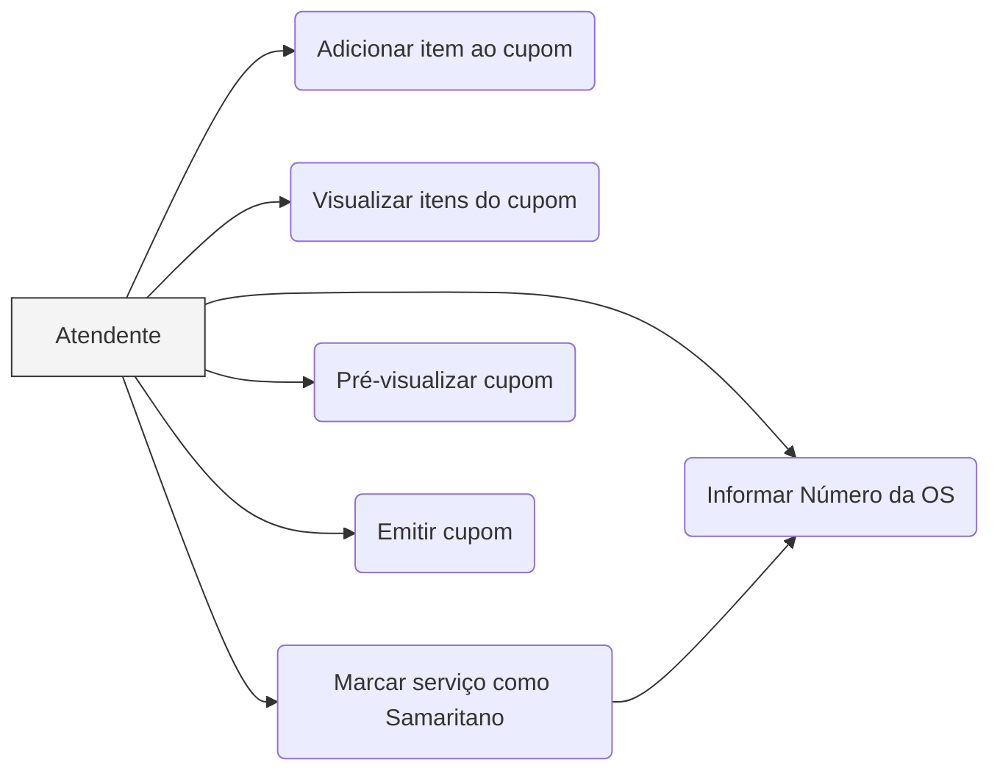

```mermaid
flowchart LR
    A[Atendente] --> UC1(Adicionar item ao cupom)
    A --> UC2(Visualizar itens do cupom)
    A --> UC3(Marcar serviço como Samaritano)
    A --> UC4(Informar Número da OS)
    A --> UC5(Pré-visualizar cupom)
    A --> UC6(Emitir cupom)

    UC3 --> UC4

    classDef actor fill:#f4f4f4,stroke:#333,stroke-width:1px;
    class A actor;

```